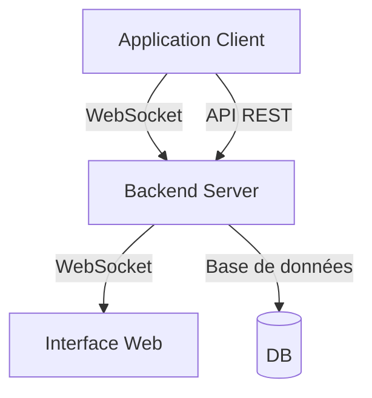

# NehonixSmartLogger

Une bibliothèque de logging intelligente et sécurisée avec interface de suivi en temps réel.

## Table des matières

- [Fonctionnalités](#fonctionnalités)
- [Installation](#installation)
- [Guide de démarrage rapide](#guide-de-démarrage-rapide)
- [Configuration avancée](#configuration-avancée)
- [Interface Web](#interface-web)
- [Sécurité](#sécurité)
- [API Reference](#api-reference)
- [Architecture](#architecture)
- [Contribution](#contribution)

## Fonctionnalités

- 🔄 **Logging en temps réel** avec interface web de suivi
- 🔒 **Chiffrement des logs** pour données sensibles
- 🎛️ **Configuration à distance** des niveaux et comportements de log
- 📊 **Métriques de performance** et détection d'anomalies
- 💾 **Persistance configurable** des logs
- 🌐 **Mode hors ligne** avec synchronisation automatique

## Installation

```bash
npm install nehonix-logger
# ou
yarn add nehonix-logger
```

## Guide de démarrage rapide

### 1. Configuration basique

Créez un fichier `nehonix.config.json` :

```json
{
  "app": {
    "provider": "nehonix",
    "apiKey": "votre-clé-api",
    "appId": "votre-app-id",
    "name": "Mon Application"
  },
  "logLevel": "debug",
  "console": {
    "enabled": true,
    "showTimestamp": true,
    "colorized": true
  }
}
```

### 2. Initialisation

```typescript
import { NehonixSmartLogger } from "nehonix-logger";

// Méthode recommandée : utilisation d'un fichier de configuration
const logger = NehonixSmartLogger.from("./config").import(
  "nehonix.config.json"
);

// Alternative : instance unique
const NSL = NehonixSmartLogger.getInstance();
```

### 3. Utilisation

```typescript
// Logging simple
logger.log("Message simple");

// Logging avec niveau
logger.log("Une erreur est survenue", { level: "error" });
logger.log("Information importante", { level: "info" });
logger.log("Message de debug", { level: "debug" });

// Logging avec métadonnées
logger.log("Transaction effectuée", {
  level: "info",
  metadata: {
    transactionId: "123",
    amount: 100,
    currency: "EUR",
  },
});
```

## Configuration avancée

### Structure complète de configuration

```typescript
interface LoggerConfig {
  app: {
    provider: string;
    apiKey: string;
    appId: string;
    name: string;
  };
  logLevel: "error" | "warn" | "info" | "debug" | "trace";
  encryption?: {
    enabled: boolean;
    key?: string;
  };
  console?: {
    enabled: boolean;
    showTimestamp: boolean;
    showLogLevel: boolean;
    colorized: boolean;
    format: "simple" | "detailed";
  };
  persistence?: {
    enabled: boolean;
    maxSize: number;
    rotationInterval: "hourly" | "daily" | "weekly";
    retentionPeriod: number;
    compressArchives: boolean;
  };
  network?: {
    batchSize: number;
    retryAttempts: number;
    retryDelay: number;
    timeout: number;
    offlineStorage: boolean;
    maxOfflineSize: number;
  };
  performance?: {
    enabled: boolean;
    samplingRate: number;
    maxEventsPerSecond: number;
    monitorMemory: boolean;
    monitorCPU: boolean;
  };
}
```

### Chiffrement des logs

```typescript
// Configuration du chiffrement
const logger = NehonixSmartLogger.from("./config").import(
  "nehonix.config.json"
);

// Les logs sensibles seront automatiquement chiffrés
logger.log("Données sensibles", {
  level: "info",
  encryption: true,
});
```

## Interface Web

L'interface web offre :

- 📊 Dashboard en temps réel
- 🔍 Filtrage et recherche avancée des logs
- 📈 Visualisation des métriques de performance
- ⚙️ Configuration à distance des comportements de log
- 🔔 Système d'alertes et notifications

### Accès à l'interface

1. Créez un compte sur [https://console.nehonix.com](https://console.nehonix.com)
2. Ajoutez votre application
3. Récupérez vos identifiants (apiKey, appId)
4. Configurez votre logger avec ces identifiants

## Sécurité

### Chiffrement

- Chiffrement AES-256-CBC pour les logs sensibles
- Transmission sécurisée via WebSocket avec double chiffrement
- Gestion sécurisée des clés de chiffrement

### Authentification

- JWT pour l'API REST
- Tokens sécurisés pour les connexions WebSocket
- Rotation automatique des clés

## API Reference

### Méthodes principales

```typescript
// Initialisation
static from(configPath: string): NehonixSmartLogger
static getInstance(): NehonixSmartLogger

// Logging
log(message: string, options?: LogOptions): void
error(message: string, metadata?: any): void
warn(message: string, metadata?: any): void
info(message: string, metadata?: any): void
debug(message: string, metadata?: any): void

// Configuration
updateConfig(config: Partial<LoggerConfig>): void
enableEncryption(key?: string): void
disableEncryption(): void
```

## Architecture



## Contribution

Les contributions sont les bienvenues ! Consultez notre [guide de contribution](CONTRIBUTING.md) pour plus d'informations.

## Licence

MIT © [Nehonix](https://nehonix.com)
