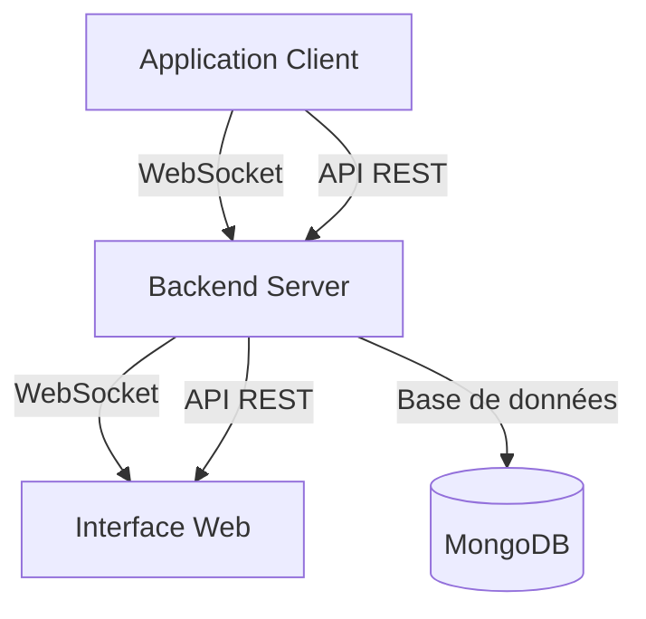

# NehonixSmartLogger - Flux Complet du Projet

## 1. Objectif du Projet

NehonixSmartLogger est une bibliothèque de logging puissante qui offre :

- Un système de logging intelligent et configurable
- Une interface web de suivi en temps réel
- Un contrôle à distance des logs
- Une analyse des performances et détection d'anomalies

### 1.1 Problématique Résolue

Les développeurs rencontrent souvent ces problèmes :

- Trop de `console.log` en production
- Difficulté à suivre les logs en temps réel
- Manque de visibilité sur les performances
- Absence de contrôle à distance des logs

### 1.2 Solution Proposée

NehonixSmartLogger offre :

- Une interface web intuitive pour suivre les logs
- La possibilité de désactiver les logs console à distance
- Des métriques de performance en temps réel
- Une détection automatique des anomalies

## 2. Architecture Globale



### 2.1 Composants

1. **Application Client**

   - Bibliothèque NehonixSmartLogger
   - Configuration locale
   - Connexion WebSocket

2. **Backend Server**

   - API REST
   - Serveur WebSocket
   - Base de données
   - Services d'analyse

3. **Interface Web**
   - Dashboard
   - Visualisation des logs
   - Configuration
   - Alertes

## 3. Tâches par Équipe

### 3.1 Équipe Frontend (Interface Web)

1. **Dashboard Principal**

   ```typescript
   // Structure des composants
   /src
     /components
       /dashboard
         Dashboard.tsx
         AppList.tsx
         MetricsOverview.tsx
       /logs
         LogViewer.tsx
         LogFilter.tsx
         LogDetails.tsx
       /analytics
         PerformanceCharts.tsx
         AnomalyDetection.tsx
         Alerts.tsx
   ```

2. **Fonctionnalités à Implémenter**

   - Authentification
   - Liste des applications
   - Visualisation des logs en temps réel
   - Graphiques de performance
   - Système d'alertes
   - Configuration des applications

3. **Technologies Utilisées**
   - React
   - TypeScript
   - WebSocket
   - Chart.js/D3.js
   - SCSS / react-lucide (pour les icones)

### 3.2 Équipe Backend

1. **API REST**

   ```typescript
   // Endpoints principaux (ça peut changer)
   POST /api/auth/login
   POST /api/auth/register
   GET /api/apps
   POST /api/apps
   GET /api/apps/:appId/logs
   GET /api/apps/:appId/metrics
   POST /api/apps/:appId/config
   ```

2. **WebSocket Server**

   ```typescript
   // Types de messages
   interface WebSocketMessage {
     type: "logs" | "metrics" | "config" | "auth";
     payload: any;
   }
   ```

3. **Base de Données**

   ```typescript
   // Collections FireBase
   interface User {
     <!--userInfoType voir l'\interface pour les données de l\'utilisateur -->
     apps: string[];
   }

   interface App {
     id: string;
     name: string;
     userId: string;
     config: AppConfig;
     status: "active" | "inactive";
   }

   interface Log {
     id: string;
     appId: string;
     timestamp: Date;
     level: string;
     message: string;
     metadata: any;
   }

   interface Metric {
     id: string;
     appId: string;
     timestamp: Date;
     cpu: number;
     memory: number;
     disk: number;
     network: number;
   }
   ```

4. **Services**
   - Service d'authentification
   - Service de logging
   - Service de métriques
   - Service d'analyse d'anomalies

### 3.3 Équipe Bibliothèque (NehonixSmartLogger)

1. **Configuration**

   ```typescript
   // Structure de configuration
   interface LoggerConfig {
     /** Clé d'authentification pour l'API */
     apiKey: string;
     /** Identifiant unique de l'application */
     appId: string;
     /** URL du WebSocket pour la communication en temps réel */
     wsUrl: string;
     /** Niveau de log global */
     logLevel: LogLevel;
     /** Configuration du chiffrement */
     encryption?: Encryption;
     /** Configuration de l'affichage console */
     console?: ConsoleConfig;
     /** Configuration du stockage persistant */
     persistence?: PersistenceConfig;
     /** Configuration réseau */
     network?: NetworkConfig;
     /** Configuration du monitoring des performances */
     performance?: PerformanceConfig;
   } // ou AppConfig
   ```

2. **Fonctionnalités**

   - Connexion WebSocket
   - Envoi des logs
   - Collecte des métriques
   - Gestion de la configuration

3. **API Publique**

## Utilisation (Sans suivie à distance)

### Importation

```typescript
import { NSMLogger } from "nehonix-logger";
//ou
import { NehonixSmartLogger } from "nehonix-logger";
const NSL = NehonixSmartLogger.getInstance();
```

### Exemples d'utilisation

#### Log simple

```typescript
NSMLogger("Message simple");
// ou
NSL.log("Message simple");
```

#### Log avec niveau

```typescript
NSMLogger("error", "Une erreur est survenue");
NSMLogger("warn", "Attention !");
NSMLogger("info", "Information importante");
NSMLogger("debug", "Message de debug");

// ou
NSL.log("error", "Une erreur est survenue");
NSL.log("warn", "Attention !");
NSL.log("info", "Information importante");
NSL.log("debug", "Message de debug");
```

#### Log avec configuration

```typescript
NSMLogger(
  {
    logMode: {
      enable: true,
      name: "mon-app",
      saved_message: "enable",
      display_log: true,
      crypt: {
        CRYPT_DATAS: {
          lockStatus: "enable",
          key: "votre-clé-hexadécimale",
        },
      },
    },
    groupInterval: 5000, // Intervalle en ms entre les marqueurs de groupe
  },
  "Message avec configuration"
);
//Ou
NSL.log(
  {
    logMode: {
      enable: true,
      name: "mon-app",
      saved_message: "enable",
      display_log: true,
      crypt: {
        CRYPT_DATAS: {
          lockStatus: "enable",
          key: "votre-clé-hexadécimale",
        },
      },
    },
    groupInterval: 5000, // Intervalle en ms entre les marqueurs de groupe
  },
  "Message avec configuration"
);
```

## Utilisation (Avec suivie à distance)

### Configuration avec fichier de config

```typescript
export const _nls_auth_ = NSL.from("path_to_config_file").import(
  "config_file_name"
);
export const logger = _nls_auth_.log;
//example
logger("Hello world");
```

## 4. Flux d'Utilisation

### 4.1 Configuration Initiale

1. **Création du Compte**

   - Inscription sur l'interface web
   - Validation de l'email
   - Création du profil

2. **Création d'une Application**

   - Nom de l'application
   - Configuration initiale
   - Génération des identifiants

3. **Intégration dans le Projet**

   ```typescript
   // 1. Installation
   npm install nehonix-logger

   // 2. Configuration
   /*
    La configuration est de ce type:
   */
   type config = AppConfig & {
        app: {
          provider: string;
          apiKey: string;
          appId: string;
          name: string;
        };

   // config/nehonix.config.json (exemple)
   {
   "logLevel": "debug",
   "encryption": {
    "enabled": false,
    "key": ""
   },
   "console": {
    "enabled": true,
    "showTimestamp": true,
    "showLogLevel": true,
    "colorized": true,
    "format": "simple"
   },
   "persistence": {
    "enabled": false,
    "maxSize": 100,
    "rotationInterval": "daily",
    "retentionPeriod": 30,
    "compressArchives": true
   },
   "network": {
    "batchSize": 50,
    "retryAttempts": 3,
    "retryDelay": 1000,
    "timeout": 5000,
    "offlineStorage": true,
    "maxOfflineSize": 50
   },
   "performance": {
    "enabled": false,
    "samplingRate": 10,
    "maxEventsPerSecond": 100,
    "monitorMemory": true,
    "monitorCPU": true
   }
   }

   // 3. Initialisation
   import { NSMLogger } from "nehonix-smart-logger";
   import config from "./config/nehonix.config.json";
   NSMLogger.initialize(config);
   ```

### 4.2 Utilisation Quotidienne

1. **Logging**

   ```typescript
   // Au lieu de console.log: voir les exemples ci-dessus
   ```

2. **Suivi en Temps Réel**

   - Visualisation des logs
   - Métriques de performance
   - Alertes et anomalies

3. **Configuration à Distance**
   - Activation/désactivation des logs (permettre à ce qu'un log s'affiche ou pas dans le navigateur)
   - Modification des niveaux
   - Gestion des alertes
   -Possibilité de chiffrer les données avant qu'elle n'atteignent l'interface

## 5. Sécurité

### 5.1 Authentification

- JWT pour l'API REST
- Tokens pour WebSocket
- Sessions sécurisées

### 5.2 Protection des Données

- Chiffrement des logs sensibles
- Masquage des informations critiques
- Gestion des accès

## 6. Performance

### 6.1 Optimisations

- Batching des logs
- Compression des données
- Cache intelligent

### 6.2 Scalabilité

- Architecture distribuée
- Load balancing
- Sharding des données

## 7. Prochaines Étapes

### 7.1 Phase 1 

- Interface web basique
- Logging en temps réel
- Métriques essentielles

### 7.2 Phase 2 - Fonctionnalités Avancées

- Détection d'anomalies
- Alertes personnalisées
- Analyses avancées

### 7.3 Phase 3 - Optimisations

- Performance
- Scalabilité
- Expérience utilisateur

## 8. Documentation

### 8.1 Documentation Technique

- Guide d'installation
- API Reference
- Exemples d'utilisation

### 8.2 Documentation Utilisateur

- Guide de démarrage
- Tutoriels
- FAQ

## 9. Tests

### 9.1 Tests Frontend

- Tests unitaires
- Tests d'intégration
- Tests E2E

### 9.2 Tests Backend

- Tests API
- Tests WebSocket
- Tests de performance

### 9.3 Tests Bibliothèque

- Tests unitaires
- Tests d'intégration
- Tests de compatibilité
