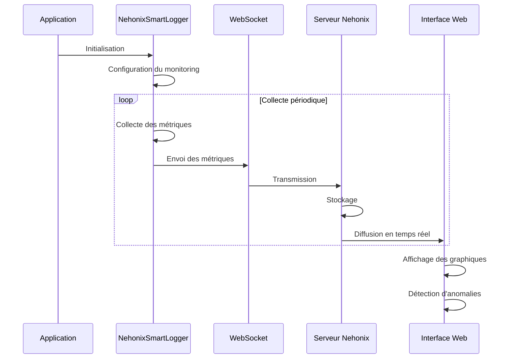
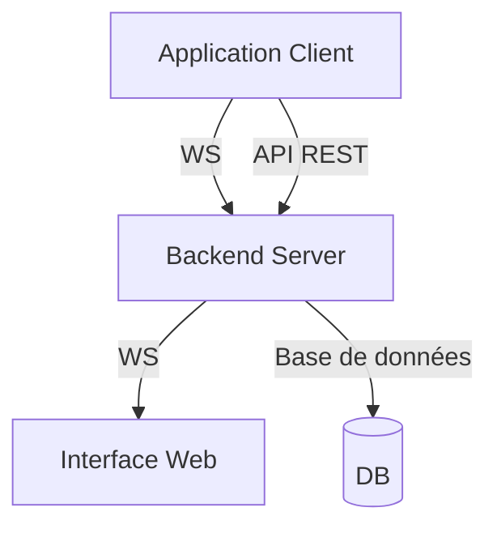

# NehonixSmartLogger

Une bibliothèque de logging intelligente et sécurisée avec interface de suivi en temps réel.

## Table des matières

- [Fonctionnalités](#fonctionnalités)
- [Installation](#installation)
- [Guide de démarrage rapide](#guide-de-démarrage-rapide)
- [Configuration avancée](#configuration-avancée)
- [Interface Web](#interface-web)
- [Monitoring des performances](#monitoring-des-performances)
- [Sécurité](#sécurité)
- [API Reference](#api-reference)
- [Architecture](#architecture)
- [Contribution](#contribution)

## Fonctionnalités

- **Logging en temps réel** avec interface web de suivi
- **Chiffrement des logs** pour données sensibles
- **Configuration à distance** des niveaux et comportements de log
- **Métriques de performance** et détection d'anomalies
- **Persistance configurable** des logs
- **Mode hors ligne** avec synchronisation automatique

## Installation

```bash
npm install nehonix-logger
# ou
yarn add nehonix-logger
```

## Guide de démarrage rapide

### 1. Configuration basique

Créez un fichier `nehonix.config.json`:

```json
{
  "app": {
    "provider": "nehonix",
    "apiKey": "votre-clé-api",
    "appId": "votre-app-id",
    "name": "Mon Application"
  },
  "logLevel": "debug",
  "console": {
    "enabled": true,
    "showTimestamp": true,
    "colorized": true
  }
}
```

### 2. Initialisation

```typescript
import { NehonixSmartLogger } from "nehonix-logger";

// Méthode recommandée : utilisation d'un fichier de configuration
/**
 * NOTE: la lecture se fait à la racine du projet exemple:
 *
 * -Mon_Projet:
 *   -src
 *   -public
 *   -other
 *   -config
 *      - nehonix.config.json
 *      - autre_config.json
 */
const logger = NehonixSmartLogger.from("./config").import(
  "nehonix.config.json" //ou autre_config.json si le fichier se trouve par exemple dans src, avancez d'un niveau, exemple: ./src/config ou ./../config
);

// Par défaut, le logger démarre en mode local
logger.info("Message en mode local");
logger.debug("Debug en mode local");

// Activation du mode remote pour la synchronisation avec le serveur
logger.enableRemoteMode();

// Les logs suivants seront envoyés au serveur
logger.info("Message en mode remote");
logger.debug("Debug en mode remote");

// Retour au mode local si nécessaire
logger.disableRemoteMode();
```

### 3. Utilisation des différents niveaux de log

```typescript
// Méthodes de log simplifiées
logger.info("Information importante");
logger.error("Une erreur est survenue");
logger.warn("Attention");
logger.debug("Message de debug");

// Logging avec options avancées
logger.logWithOptions(
  {
    logMode: {
      enable: true,
      name: "app-log",
    },
    typeOrMessage: "info",
  },
  "Message avec options avancées"
);
```

## Modes de fonctionnement

### Mode Local

Le mode local est le mode par défaut après l'initialisation. Dans ce mode :

- Les logs sont affichés dans la console
- L'analyse des logs est effectuée localement
- Les logs peuvent être écrits dans des fichiers locaux
- Aucune connexion au serveur n'est établie

### Mode Remote

Le mode remote est activé soit explicitement via `enableRemoteMode()`, soit automatiquement lors de l'import d'une configuration. Dans ce mode :

- Les logs sont envoyés au serveur Nehonix
- L'affichage console peut être configuré (activé/désactivé)
- Les logs peuvent être chiffrés avant transmission
- L'interface web permet de visualiser les logs en temps réel
- La configuration peut être modifiée à distance

Pour activer/désactiver le mode remote :

```typescript
// Activation du mode remote
logger.enableRemoteMode();

// Désactivation du mode remote
logger.disableRemoteMode();
```

## Configuration avancée

### Structure complète de configuration (peut changer)

```typescript
interface LoggerConfig {
  app: {
    provider: string;
    apiKey: string;
    appId: string;
    name: string;
  };
  logLevel: "error" | "warn" | "info" | "debug" | "trace";
  encryption?: {
    enabled: boolean;
    key?: string;
  };
  console?: {
    enabled: boolean;
    showTimestamp: boolean;
    showLogLevel: boolean;
    colorized: boolean;
    format: "simple" | "detailed";
  };
  persistence?: {
    enabled: boolean;
    maxSize: number;
    rotationInterval: "hourly" | "daily" | "weekly";
    retentionPeriod: number;
    compressArchives: boolean;
  };
  network?: {
    batchSize: number;
    retryAttempts: number;
    retryDelay: number;
    timeout: number;
    offlineStorage: boolean;
    maxOfflineSize: number;
  };
  performance?: {
    enabled: boolean;
    samplingRate: number;
    maxEventsPerSecond: number;
    monitorMemory: boolean;
    monitorCPU: boolean;
  };
}
```

### Chiffrement des logs

```typescript
// Configuration du chiffrement
const logger = NehonixSmartLogger.from("./config").import(
  "nehonix.config.json"
);

// Les logs sensibles seront automatiquement chiffrés
logger.log(
  {
    level: "info",
    encryption: true,
  },
  "Données sensibles"
);
```

## Interface Web

L'interface web offre :

- Dashboard en temps réel
- Filtrage et recherche avancée des logs
- Visualisation des métriques de performance
- Configuration à distance des comportements de log
- Système d'alertes et notifications

### Accès à l'interface

1. Créez un compte sur [https://console.nehonix.space](https://console.nehonix.space)
2. Ajoutez votre application
3. Récupérez vos identifiants (apiKey, appId)
4. Configurez votre logger avec ces identifiants

## Monitoring des performances

NehonixSmartLogger intègre un système de monitoring des performances qui collecte et transmet automatiquement des métriques sur l'utilisation des ressources de votre application.

### Configuration du monitoring

Activez le monitoring dans votre configuration :

```json
{
  "performance": {
    "enabled": true,
    "samplingRate": 5000, // Intervalle de collecte en ms
    "maxEventsPerSecond": 10,
    "monitorMemory": true,
    "monitorCPU": true
  }
}
```

### Métriques collectées

Le système collecte les métriques suivantes :

- **CPU** : Utilisation, nombre de cœurs, charge moyenne
- **Mémoire** : Utilisation totale, mémoire libre, pourcentage d'utilisation
- **Processus** : Temps de fonctionnement, utilisation de la mémoire du processus
- **Réseau** : Octets reçus/envoyés, paquets reçus/envoyés par interface
- **Connexions** : Nombre de connexions actives
- **Taux de messages** : Fréquence des logs par niveau
- **Taux d'erreurs** : Fréquence des erreurs

### Flux des métriques



### Visualisation des métriques

Dans l'interface web, les métriques sont présentées sous forme de graphiques interactifs :

- **Graphiques en temps réel** : Visualisation des tendances
- **Vue d'ensemble** : Résumé des performances actuelles
- **Détection d'anomalies** : Identification des comportements inhabituels
- **Analyse des logs** : Corrélation entre les logs et les métriques

### Intégration avec les logs

Le système de monitoring est étroitement intégré avec le système de logging :

- Les pics d'utilisation des ressources sont automatiquement associés aux logs correspondants
- Les anomalies détectées génèrent des logs d'avertissement
- Les tendances de performance sont analysées pour prédire les problèmes potentiels

## Sécurité

### Chiffrement

- Chiffrement AES-256-CBC pour les logs sensibles
- Transmission sécurisée via WebSocket avec double chiffrement
- Gestion sécurisée des clés de chiffrement

### Authentification

- JWT pour l'API REST
- Tokens sécurisés pour les connexions WebSocket
- Rotation automatique des clés

## API Reference

### Méthodes principales

```typescript
// Initialisation
static from(configPath: string): NehonixSmartLogger
static getInstance(): NehonixSmartLogger

// Logging
log(message: string, options?: LogOptions): void
error(message: string, metadata?: any): void
warn(message: string, metadata?: any): void
info(message: string, metadata?: any): void
debug(message: string, metadata?: any): void

// Configuration
updateConfig(config: Partial<LoggerConfig>): void
enableEncryption(key?: string): void
disableEncryption(): void
```

## Architecture



## Contribution

Les contributions sont les bienvenues ! Consultez notre [guide de contribution](CONTRIBUTING.md) pour plus d'informations.

## Licence

MIT © [Nehonix](https://nehonix.space)
