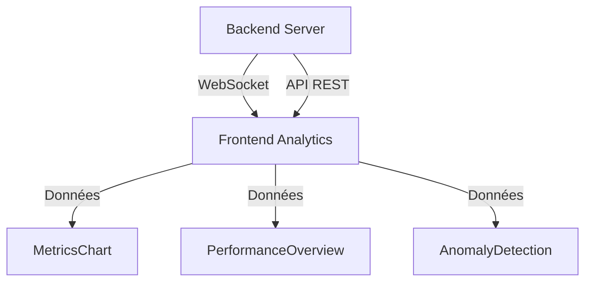

# Flux Détaillé de l'Application

## 1. Architecture Globale



## 2. Composants Frontend

### 2.1 Page Analytics (`Analytics.tsx`)

Point d'entrée principal pour l'affichage des métriques et analyses.

#### États

```typescript
{
  metrics: PerformanceMetrics | null;    // Métriques de performance
  logs: LogEntry[];                      // Liste des logs
  timeRange: TimeRange;                  // Période d'analyse
  loading: boolean;                      // État de chargement
  isConnected: boolean;                  // État WebSocket
}
```

#### Flux de données

1. **Initialisation**

   ```typescript
   // Récupération de l'ID de l'application depuis l'URL
   const { appId } = useParams<{ appId: string }>();

   // Configuration WebSocket
   const { isConnected, setFilters } = useWebSocket({
     wsUrl: NHX_CONFIG._global_.__WEBSOCKET_URL__,
     appId: appId || "",
     userId: "user123",
     onLogs: (newLogs) => setLogs((prev) => [...prev, ...newLogs]),
     onMetrics: setMetrics,
   });
   ```

2. **Chargement des données historiques**
   ```typescript
   useEffect(() => {
     const fetchHistoricalData = async () => {
       const [metricsData, logsData] = await Promise.all([
         appApi.getMetrics(appId, timeRange.type),
         appApi.getLogs(appId, timeRange.type),
       ]);
       setMetrics(metricsData);
       setLogs(logsData);
     };
     fetchHistoricalData();
   }, [appId, timeRange]);
   ```

### 2.2 Composant MetricsChart

Affiche les graphiques de performance en temps réel.

#### Données reçues

```typescript
interface PerformanceMetrics {
  cpu: {
    usage: number; // Pourcentage d'utilisation
    cores: number; // Nombre de cœurs
  };
  memory: {
    used: number; // Mémoire utilisée (octets)
    free: number; // Mémoire libre (octets)
    total: number; // Mémoire totale (octets)
  };
  disk: {
    used: number; // Espace utilisé (octets)
    free: number; // Espace libre (octets)
    total: number; // Espace total (octets)
  };
  network: {
    bytesReceived: number; // Octets reçus
    bytesSent: number; // Octets envoyés
    connections: number; // Nombre de connexions
  };
}
```

#### Graphiques générés

1. **Utilisation CPU**

   - Graphique en ligne
   - Pourcentage d'utilisation
   - Mise à jour en temps réel

2. **Utilisation Mémoire**

   - Graphique en barres
   - Mémoire utilisée vs libre
   - Pourcentage d'utilisation

3. **Utilisation Disque**
   - Graphique en barres
   - Espace utilisé vs libre
   - Pourcentage d'utilisation

### 2.3 Composant PerformanceOverview

Affiche une vue d'ensemble des performances.

#### Calculs effectués

1. **Score de Performance**

   ```typescript
   const getPerformanceScore = () => {
     const cpuScore = 100 - metrics.cpu.usage;
     const memoryScore =
       100 - (metrics.memory.used / metrics.memory.total) * 100;
     const diskScore = 100 - (metrics.disk.used / metrics.disk.total) * 100;
     return Math.round((cpuScore + memoryScore + diskScore) / 3);
   };
   ```

2. **Taux d'Erreurs**
   ```typescript
   const getErrorRate = () => {
     const errorLogs = logs.filter(
       (log) => log.level === "error" || log.level === "fatal"
     );
     return (errorLogs.length / logs.length) * 100;
   };
   ```

#### Affichage

1. **Score Global**

   - Cercle de score avec couleur
   - Statut (Excellent/Bon/Moyen/Critique)

2. **Statistiques**

   - Taux d'erreurs
   - Total des logs
   - Nombre de processus
   - Connexions réseau

3. **Recommandations**
   - Basées sur les seuils de performance
   - Alertes pour les problèmes critiques

### 2.4 Composant AnomalyDetection

Analyse les logs pour détecter les anomalies.

#### Types d'Anomalies

1. **Erreurs Critiques**

   - Logs de niveau "error" ou "fatal"
   - Patterns d'erreurs répétées

2. **Problèmes de Performance**

   - Utilisation CPU élevée
   - Mémoire insuffisante
   - Latence réseau

3. **Patterns Suspects**
   - Tentatives d'accès non autorisées
   - Comportements anormaux

## 3. Communication Backend

### 3.1 WebSocket

Gestion de la connexion en temps réel.

#### Configuration

```typescript
{
  wsUrl: string; // URL du serveur WebSocket
  appId: string; // ID de l'application
  userId: string; // ID de l'utilisateur
  onLogs: Function; // Callback pour les logs
  onMetrics: Function; // Callback pour les métriques
}
```

#### Messages

1. **Connexion**

   ```typescript
   {
     type: "connect",
     payload: {
       appId: string;
       userId: string;
     }
   }
   ```

2. **Métriques**

   ```typescript
   {
     type: "metrics",
     payload: PerformanceMetrics
   }
   ```

3. **Logs**
   ```typescript
   {
     type: "logs",
     payload: LogEntry[]
   }
   ```

### 3.2 API REST

Endpoints pour les données historiques.

#### Endpoints

1. **GET /api/apps/:appId/metrics**

   ```typescript
   // Paramètres
   {
     appId: string;
     timeRange: "hour" | "day" | "week";
   }

   // Réponse
   PerformanceMetrics;
   ```

2. **GET /api/apps/:appId/logs**

   ```typescript
   // Paramètres
   {
     appId: string;
     timeRange: "hour" | "day" | "week";
   }

   // Réponse
   LogEntry[]
   ```

## 4. Gestion des Erreurs

### 4.1 Frontend

1. **Vérifications de sécurité**

   ```typescript
   // Exemple de vérification
   const safeMetrics = {
     cpu: {
       usage: metrics?.cpu?.usage ?? 0,
       cores: metrics?.cpu?.cores ?? 0,
     },
     // ...
   };
   ```

2. **États de chargement**

   ```typescript
   {loading ? (
     <div className="loading">Chargement...</div>
   ) : (
     // Contenu
   )}
   ```

3. **Gestion WebSocket**
   ```typescript
   // Reconnexion automatique
   if (!isConnected) {
     // Tentative de reconnexion
   }
   ```

### 4.2 Backend

1. **Validation des données**

   - Vérification des types
   - Validation des valeurs
   - Sanitization

2. **Rate Limiting**
   - Limite de requêtes
   - Gestion des timeouts
   - Protection contre les abus

## 5. Performance

### 5.1 Optimisations Frontend

1. **Re-rendus**

   - Utilisation de `useMemo`
   - Optimisation des calculs
   - Pagination des logs

2. **Mémoire**
   - Nettoyage des données anciennes
   - Limitation du nombre de logs affichés
   - Gestion des graphiques

### 5.2 Optimisations Backend

1. **Cache**

   - Mise en cache des données fréquentes
   - Invalidation intelligente
   - Compression des données

2. **Base de données**
   - Indexation optimisée
   - Requêtes efficaces
   - Agrégation des données

## 6. Sécurité

### 6.1 Authentification

1. **WebSocket**

   - Token JWT
   - Validation des sessions
   - Timeout des connexions

2. **API REST**
   - API Keys
   - Rate limiting
   - Validation des requêtes

### 6.2 Protection des données

1. **Validation**

   - Sanitization des entrées
   - Validation des types
   - Protection contre les injections

2. **Confidentialité**
   - Chiffrement des données sensibles
   - Masquage des informations critiques
   - Logs sécurisés
