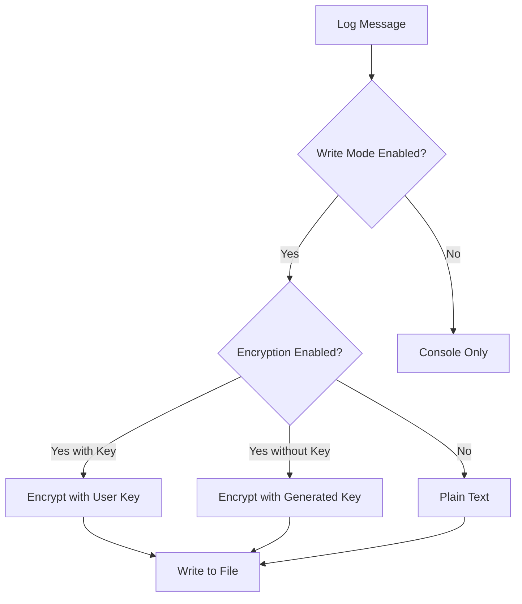
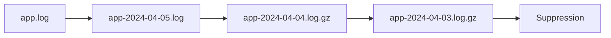

# Comment bien utiliser les modes d'écriture des logs ? Guide d'utilisation des options d'écriture de logs

<div align="center">


[](../README.md)

</div>

<p align="center">
  <video src="https://lottie.host/embed/7c915914-a2a7-4145-9b91-2e65409a0406/zzkkCtm6Ld.lottie" alt="NehonixLogger File Logging" width="600">
</p>

> Un système complet pour gérer vos logs avec sécurité et flexibilité

Ce guide explique en détail comment utiliser les fonctionnalités avancées d'écriture de logs dans NehonixSmartLogger.

## Table des matières

- [Introduction](#introduction)
- [Modes d'écriture](#modes-décriture)
- [Configuration de base](#configuration-de-base)
- [Chiffrement des logs](#chiffrement-des-logs)
- [Rotation des logs](#rotation-des-logs)
- [Exemples pratiques](#exemples-pratiques)
- [Bonnes pratiques](#bonnes-pratiques)

## Introduction

NehonixSmartLogger offre un système flexible et sécurisé pour l'écriture des logs dans des fichiers. Cette fonctionnalité est particulièrement utile pour :

- Conserver un historique permanent des logs
- Sécuriser les données sensibles
- Gérer efficacement l'espace disque
- Organiser les logs par période

## Modes d'écriture

### Structure des options

```typescript
interface WriteFileMode {
  enable: boolean; // Active/désactive l'écriture dans un fichier
  fileName?: string; // Nom du fichier de log
  saved_message?: "enable" | "disable"; // Message de confirmation
  display_log?: boolean; // Affichage console en parallèle
  log_rotation?: LogRotationConfig; // Configuration de la rotation
  crypt?: {
    CRYPT_DATAS?: {
      lockStatus: "enable" | "disable";
      key?: string;
      iv?: Buffer;
    };
  };
}
```

### Diagramme de flux



## Configuration de base

### Exemple simple

```typescript
logger.logWithOptions(
  {
    writeFileMode: {
      enable: true,
      fileName: "app.log",
    },
    typeOrMessage: "info",
  },
  "Message à enregistrer"
);
```

### Configuration complète

```typescript
logger.logWithOptions(
  {
    writeFileMode: {
      enable: true,
      fileName: "secure.log",
      saved_message: "enable",
      display_log: true,
      log_rotation: {
        maxSize: 100, // MB
        maxFiles: 10,
        compress: true,
        interval: "daily",
      },
    },
    typeOrMessage: "info",
  },
  "Message avec configuration complète"
);
```

## Chiffrement des logs

### Modes de chiffrement

1. **Sans chiffrement** : Les logs sont écrits en texte brut
2. **Chiffrement avec clé utilisateur** : Utilise une clé fournie
3. **Chiffrement automatique** : Utilise une clé générée automatiquement

### Format des logs chiffrés

```
// Log non chiffré
[2024-04-05T10:00:00.000Z] [INFO] Message normal

// Log chiffré avec clé utilisateur
flag:userkey:<iv>:<encrypted_content>

// Log chiffré avec clé générée
flag:nokey:<iv>:<encrypted_content>@_k:<encryption_key>
```

### Exemple de chiffrement

```typescript
// Avec clé utilisateur
const userKey = "votre-clé-hexadécimale-de-32-octets";
logger.logWithOptions(
  {
    writeFileMode: {
      enable: true,
      fileName: "secure.log",
      crypt: {
        CRYPT_DATAS: {
          lockStatus: "enable",
          key: userKey,
        },
      },
    },
    typeOrMessage: "info",
  },
  "Message confidentiel"
);

// Avec clé générée automatiquement
logger.logWithOptions(
  {
    writeFileMode: {
      enable: true,
      fileName: "secure.log",
      crypt: {
        CRYPT_DATAS: {
          lockStatus: "enable",
        },
      },
    },
    typeOrMessage: "info",
  },
  "Message confidentiel"
);
```

### Déchiffrement des logs

```typescript
// Déchiffrement avec clé utilisateur
const decrypted = logger.decryptEncFileLog({
  path: "secure.log",
  key: userKey,
});

// Déchiffrement automatique (pour les logs avec clé incluse)
const decrypted = logger.decryptEncFileLog({
  path: "secure.log",
});
```

## Rotation des logs

La rotation des logs permet de gérer efficacement l'espace disque et d'organiser les logs par période.

### Configuration de la rotation

```typescript
const rotationConfig = {
  maxSize: 100, // Taille maximale en MB
  maxFiles: 10, // Nombre maximum de fichiers
  compress: true, // Compression des anciens logs
  interval: "daily", // Rotation quotidienne
};
```

### Schéma de rotation



## Exemples pratiques

### 1. Logs d'application de production

```typescript
logger.logWithOptions(
  {
    writeFileMode: {
      enable: true,
      fileName: "production.log",
      log_rotation: {
        maxSize: 500,
        maxFiles: 30,
        compress: true,
        interval: "daily",
      },
    },
    typeOrMessage: "info",
  },
  "Message de production"
);
```

### 2. Logs sécurisés pour données sensibles

```typescript
logger.logWithOptions(
  {
    writeFileMode: {
      enable: true,
      fileName: "secure.log",
      crypt: {
        CRYPT_DATAS: {
          lockStatus: "enable",
          key: process.env.LOG_ENCRYPTION_KEY,
        },
      },
      log_rotation: {
        maxSize: 100,
        maxFiles: 7,
        compress: true,
        interval: "daily",
      },
    },
    typeOrMessage: "info",
  },
  "Données sensibles"
);
```

## Bonnes pratiques

1. **Sécurité**

   - Utilisez toujours le chiffrement pour les données sensibles
   - Stockez les clés de chiffrement de manière sécurisée
   - Évitez de logger des informations personnelles

2. **Performance**

   - Configurez la rotation des logs appropriée
   - Activez la compression pour les anciens logs
   - Surveillez l'espace disque utilisé

3. **Organisation**

   - Utilisez des noms de fichiers descriptifs
   - Séparez les logs par niveau de criticité
   - Documentez vos schémas de rotation

4. **Maintenance**
   - Nettoyez régulièrement les anciens logs
   - Vérifiez périodiquement l'intégrité des logs
   - Maintenez une documentation à jour
